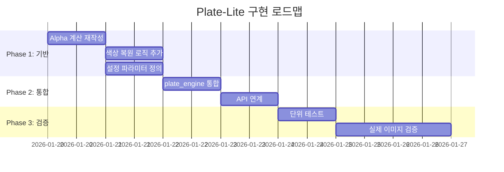

# Plate-Lite 색상 추출 개선 계획

> **작성일**: 2026-01-19
> **상태**: 🔄 계획 수립

---

## 1. 상황 종합 요약 (Diagnosis)

현재 코드베이스(`src/engine_v7/...`)는 **"물리적인 잉크 분리"**를 목표로 설계되었으나, 구현은 **"단순 배경 제거(Subtraction)"** 수준에도 미치지 못하는 상태입니다.

### 1.1 핵심 모순 (Goal Mismatch) - **HIGH ISSUE**

| 항목 | 목표 | 현재 구현 |
|------|------|----------|
| **추출 대상** | 순수 잉크색 ($I_{ink}$) | 관측된 색 ($I_{obs}$) |
| **배경 처리** | 물리적으로 분리/복원 | 그대로 통계에 포함 |

**문제점**:
- 잉크 농도가 옅은 구간(Low Alpha)에서 **잉크색이 아닌 '배경의 흰색'**이 데이터에 섞여 들어감
- 시뮬레이션 시 "잉크를 겹칠수록 색이 탁해지거나 예상과 다른 색이 나오는" 원인

### 1.2 수학적 오류 (Math Error)

잉크 추정식이 물리 모델과 **정반대**입니다.

```
[현재 코드 - 잘못된 수식]
I_est = I_white × α
→ 알파가 낮을수록 어둡게 만듦 (물리적 근거 없음)

[정상 물리식]
I_ink = (I_white - (1-α) × I_bg) / α
→ 배경색을 빼내고 잉크 본연의 색 복원
```

### 1.3 결론

> 현재 로직은 **정밀한 픽셀 단위 튜닝(Medium 이슈 수정)**으로 해결될 단계가 아니며,
> **색상 추출 수식 자체를 물리 모델 기반으로 재작성**해야 합니다.

---

## 2. 제안 진행 방향 (Direction)

**"픽셀 단위의 수정(Patch)"을 멈추고, "영역 단위의 물리 복원(Reconstruction)"으로 로직을 전환**

**[Plate-Lite 전략]**을 구현하되, **[색상 추출 수식 오류]**를 바로잡는 것이 핵심입니다.

---

## 3. 단계별 구현 계획

### Step 1. 목표 재설정: "관측색"이 아닌 "순수 잉크색" 추출

| 항목 | 변경 전 | 변경 후 |
|------|---------|---------|
| **데이터 소스** | White_Image ROI 픽셀값 평균 | 물리 역산된 순수 잉크색 |
| **핵심 지표** | $I_{obs}$ (관측색) | $I_{ink}$ (순수 잉크색) |

**변경 원리**:
- 잉크의 **'투명도($\alpha$)'**와 **'관측된 색($I_{obs}$)'**을 이용
- **역산(Inverse)**을 통해 **'순수 잉크색($I_{ink}$)'** 추출

---

### Step 2. Alpha 계산 로직 단순화 (Plate-Lite 적용)

기존의 복잡하고 해석 불가능한 Alpha 로직(diff norm, median 등)을 폐기하고, **물리적으로 명확한 채널 평균 방식** 사용

#### 2.1 입력 전처리
```python
# 모아레 제거를 위한 Gaussian Blur 적용
white_blur = cv2.GaussianBlur(white_bgr, (5, 5), 0)
black_blur = cv2.GaussianBlur(black_bgr, (5, 5), 0)
```

#### 2.2 Alpha 계산 수식
```
α = 1 - mean(I_white - I_black) / I_backlight
```

| 변수 | 설명 | 예시 값 |
|------|------|---------|
| $I_{white}$ | 흰 배경 위 관측 밝기 | RGB 평균 |
| $I_{black}$ | 검은 배경 위 관측 밝기 | RGB 평균 |
| $I_{backlight}$ | 조명 밝기 상수 | 255 또는 보정값 |

#### 2.3 출력 형태 변경
```
변경 전: 픽셀맵 (H×W ndarray)
변경 후: Zone/Cluster별 평균 Alpha 값 (Scalar)
```

---

### Step 3. 잉크 색상 복원 (Physics Inversion)

**High Issue**를 해결하기 위해, 통계 추출 단계에 **물리 기반 복원 공식** 적용

#### 3.1 잉크 복원 공식

$$C_{ink} = \frac{C_{obs} - (1 - \bar{\alpha}) \cdot C_{paper}}{\bar{\alpha}}$$

| 변수 | 설명 | 예시 |
|------|------|------|
| $C_{ink}$ | 구하려는 순수 잉크 색상 | Lab 또는 RGB |
| $C_{obs}$ | 흰 배경 위 관측 색상의 평균 | Zone Average |
| $C_{paper}$ | 렌즈 없는 흰 종이/배경 색상 | Calibration 값 |
| $\bar{\alpha}$ | 해당 Zone의 평균 Alpha | Step 2에서 계산 |

#### 3.2 효과

```
예시: α = 0.3 (옅은 잉크)

관측색: C_obs = [70, 5, 10]  (Lab)
배경색: C_paper = [95, 0, 0]  (Lab)

배경 기여분: (1 - 0.3) × [95, 0, 0] = [66.5, 0, 0]
순수 잉크색: C_ink = ([70, 5, 10] - [66.5, 0, 0]) / 0.3
                   = [11.67, 16.67, 33.33]

→ 옅은 잉크라도 배경의 흰색(0.7만큼의 기여분)을 수학적으로 분리하여
  진짜 잉크의 진한 색을 찾아낼 수 있음
```

#### 3.3 Safety Clamp (예외 처리)

```python
# α가 너무 작은 경우 (< 0.1) 노이즈 증폭 방지
if alpha_mean < 0.1:
    C_ink = C_obs  # 복원 불가, 관측색 그대로 사용
else:
    C_ink = (C_obs - (1 - alpha_mean) * C_paper) / alpha_mean
    C_ink = np.clip(C_ink, valid_range)  # 범위 제한
```

---

## 4. 구체적인 Action Items

### Priority 1: `_compute_alpha_map` 재작성

**파일**: `src/engine_v7/core/pipeline/plate_engine.py`

| 항목 | 변경 내용 |
|------|----------|
| **파라미터** | 복잡한 파라미터(diff_min 등) 제거 |
| **파이프라인** | Blur → Subtract → Normalize 단순화 |
| **출력** | 픽셀맵 → **Region-based Stats (Mean Alpha)** |

```python
def _compute_alpha_map_lite(
    white_bgr: np.ndarray,
    black_bgr: np.ndarray,
    blur_ksize: int = 5,
    backlight: float = 255.0,
) -> Tuple[float, Dict[str, Any]]:
    """
    Plate-Lite Alpha 계산: 영역 기반 평균 Alpha 반환
    """
    # 1. Gaussian Blur (모아레 제거)
    w_blur = cv2.GaussianBlur(white_bgr, (blur_ksize, blur_ksize), 0)
    b_blur = cv2.GaussianBlur(black_bgr, (blur_ksize, blur_ksize), 0)

    # 2. 채널 평균
    w_mean = w_blur.mean(axis=2).astype(np.float32)
    b_mean = b_blur.mean(axis=2).astype(np.float32)

    # 3. Alpha 계산 (물리 기반)
    diff = w_mean - b_mean
    alpha_map = 1.0 - (diff / backlight)
    alpha_map = np.clip(alpha_map, 0.02, 0.98)

    # 4. 영역 평균 반환
    alpha_mean = float(alpha_map.mean())

    return alpha_mean, {
        "method": "plate_lite",
        "blur_ksize": blur_ksize,
        "backlight": backlight,
        "alpha_mean": alpha_mean,
        "alpha_std": float(alpha_map.std()),
    }
```

---

### Priority 2: 색상 추출 로직 수정

**파일**: `src/engine_v7/core/pipeline/plate_engine.py`

현재의 `cv2.mean(white_image, mask)` 로직 뒤에 **잉크 복원 공식** 후처리 추가

```python
def _extract_pure_ink_color(
    obs_lab: np.ndarray,      # 관측된 색상 (Zone 평균)
    alpha_mean: float,        # Zone 평균 Alpha
    paper_lab: np.ndarray,    # 배경색 (Calibration)
    alpha_threshold: float = 0.1,
) -> Tuple[np.ndarray, Dict[str, Any]]:
    """
    물리 기반 순수 잉크색 복원
    """
    meta = {"method": "physics_inversion", "alpha_used": alpha_mean}

    # Safety Clamp: α가 너무 작으면 복원 불가
    if alpha_mean < alpha_threshold:
        meta["warning"] = "alpha_too_low_using_observed"
        return obs_lab, meta

    # 잉크 복원 공식: C_ink = (C_obs - (1-α)×C_paper) / α
    background_contrib = (1.0 - alpha_mean) * paper_lab
    ink_lab = (obs_lab - background_contrib) / alpha_mean

    # Lab 범위 클리핑
    ink_lab[0] = np.clip(ink_lab[0], 0, 100)      # L*
    ink_lab[1] = np.clip(ink_lab[1], -128, 127)   # a*
    ink_lab[2] = np.clip(ink_lab[2], -128, 127)   # b*

    meta["ink_lab"] = ink_lab.tolist()
    meta["obs_lab"] = obs_lab.tolist()
    meta["background_contrib"] = background_contrib.tolist()

    return ink_lab, meta
```

---

### Priority 3: 배경색($C_{paper}$) 상수 정의

**파일**: `src/engine_v7/configs/default.json`

```json
{
  "plate_lite": {
    "enabled": true,
    "blur_ksize": 5,
    "backlight": 255.0,
    "alpha_threshold": 0.1,
    "paper_color": {
      "lab": [95.0, 0.0, 0.0],
      "rgb": [245, 245, 245],
      "note": "흰 종이/배경 기준색 - 캘리브레이션 필요"
    }
  }
}
```

> **중요**: `paper_color` 값이 정확해야 복원 품질이 올라갑니다.
> 실제 촬영 환경의 흰 배경을 측정하여 보정 필요.

---

## 5. 기대 효과

| 항목 | 개선 전 | 개선 후 |
|------|---------|---------|
| **옅은 잉크 추출** | 배경 흰색에 오염됨 | 순수 잉크색 복원 |
| **시뮬레이션 정확도** | 겹칠수록 탁해짐 | 물리 기반 정확한 혼합 |
| **코드 복잡도** | 해석 불가능한 파라미터 다수 | 단순 물리 수식 기반 |
| **디버깅** | 중간 결과 해석 어려움 | 각 단계 의미 명확 |

---

## 6. 구현 로드맵



| Phase | 작업 | 파일 |
|-------|------|------|
| **1** | Alpha 계산 재작성 | `plate_engine.py` |
| **1** | 색상 복원 로직 | `plate_engine.py` |
| **1** | 설정 파라미터 | `configs/default.json` |
| **2** | plate_engine 통합 | `plate_engine.py` |
| **2** | API 연계 | `routers/v7.py` |
| **3** | 단위 테스트 | `tests/` |
| **3** | 실제 이미지 검증 | - |

---

## 7. 관련 문서

- [PLATE_ENGINE_DESIGN.md](../design/PLATE_ENGINE_DESIGN.md) - 기존 플레이트 엔진 설계
- [Longterm_Roadmap.md](../Longterm_Roadmap.md) - 장기 로드맵

---

## 8. 변경 이력

| 날짜 | 변경 내용 | 작성자 |
|------|----------|--------|
| 2026-01-19 | 초안 작성 | - |
| 2026-01-19 | Project Fit Notes 보완: 코드 정합성, 모델 비교, 설정/API 계약, 테스트 항목, 마이그레이션 전략 추가 | - |

---

## 9. Project Fit Notes (Additions)

### 9.1 Current Code Alignment

| 항목 | 현재 코드 | 계획 |
|------|----------|------|
| **파일 경로** | `src/engine_v7/core/plate/plate_engine.py` | 동일 위치에서 수정 |
| **스키마 버전** | `plate_v1.2` | `plate_v1.3` (Lite 필드 추가) |
| **Lab 통계 소스** | `white` 픽셀 (관측색) | **복원된 잉크색** |

**현재 문제 코드** (line 503):
```python
# 현재: 잘못된 수식
ink = (white_bgr * alpha[..., None]).astype(np.uint8)
```

**계획: 수정 방향**
```python
# 변경 후: 물리 기반 복원
ink = (white_bgr - (1 - alpha[..., None]) * paper_bgr) / alpha[..., None]
```

### 9.2 Model Consistency Gaps

#### Alpha 계산 모델 비교

| 항목 | 현재 코드 (v5.1) | Plate-Lite (제안) |
|------|------------------|-------------------|
| **수식** | `1 - diff_norm / p65_denom` | `1 - mean(diff) / backlight` |
| **채널 처리** | norm → median | mean → mean |
| **정규화** | 동적 p65 percentile | 고정 상수 (255) |
| **복잡도** | 높음 (bias correction 등) | 낮음 |

**결정 사항**:
- **Phase 1**: Plate-Lite 단순 모델로 병렬 구현 (기존 로직 유지)
- **Phase 2**: A/B 비교 후 우수한 모델 선택
- **Fallback**: Plate-Lite 실패 시 기존 v5.1 로직 사용

#### Zone Alpha 집계 전략

현재 코드는 **픽셀별 다중 임계값** 사용:
- `alpha_print_th_all`: 전체 인쇄 영역 (0.25)
- `alpha_print_th_core`: 코어 영역 (0.40)
- `alpha_dot_th`: 도트 영역
- `alpha_ring_th`: 링 영역 (0.55)

**Plate-Lite 집계 방식**:
```python
# Zone 평균 Alpha (마스크 기반)
zone_alpha = {
    "ring_core": np.mean(alpha_map[ring_core_mask]),
    "dot_core": np.mean(alpha_map[dot_core_mask]),
    "clear": np.mean(alpha_map[clear_mask]),
}
```

### 9.3 Config and Data Contract Updates

#### 설정 구조 (precedence 정의)

```json
{
  "plate": {
    "enabled": true,
    "schema_version": "plate_v1.2",
    "...existing_config..."
  },
  "plate_lite": {
    "enabled": false,
    "override_plate": false,
    "blur_ksize": 5,
    "backlight": 255.0,
    "alpha_threshold": 0.1,
    "paper_color": {
      "lab": [95.0, 0.0, 0.0],
      "source": "static"
    }
  }
}
```

**Precedence 규칙**:
1. `plate_lite.enabled = false` → 기존 `plate` 로직만 실행
2. `plate_lite.enabled = true, override_plate = false` → 둘 다 실행, 병렬 출력
3. `plate_lite.enabled = true, override_plate = true` → Plate-Lite만 실행

#### API 응답 구조

```json
{
  "plate": { "schema_version": "plate_v1.2", "..." },
  "plate_lite": {
    "schema_version": "plate_lite_v1.0",
    "zones": {
      "ring_core": {
        "alpha_mean": 0.78,
        "obs_lab": [45.2, 6.1, 18.9],
        "ink_lab": [32.1, 8.5, 26.3],
        "ink_hex": "#5A3D2E"
      }
    },
    "paper_color_used": { "lab": [95.0, 0.0, 0.0] },
    "warnings": []
  }
}
```

#### `paper_color` 소스 전략

| 소스 | 설명 | 업데이트 주기 |
|------|------|--------------|
| `static` | 설정 파일 고정값 | 수동 변경 시 |
| `calibration` | 캘리브레이션 데이터 | 캘리브레이션 실행 시 |
| `auto` | Clear 영역에서 자동 추출 | 매 분석마다 |

**기본값**: `static` (Lab: [95, 0, 0])

### 9.4 Test and Validation Additions

#### 회귀 테스트 항목

| 테스트 | 목적 | 기준 |
|--------|------|------|
| **Alpha 안정성** | 반복 스캔 재현성 | std < 0.02 |
| **역산 안전성** | α < 0.1 clamp 동작 | warning 발생 확인 |
| **입력 스왑 감지** | White/Black 뒤바뀜 검출 | 자동 경고/교정 |
| **경계 조건** | α = 0, α = 1 처리 | NaN/Inf 없음 |

#### A/B 비교 메트릭

```python
# plate_v1.2 vs plate_lite 비교
metrics = {
    "delta_e_ink_lab": float,      # 잉크색 차이 (ΔE)
    "alpha_correlation": float,    # Alpha 상관계수
    "processing_time_ms": float,   # 처리 시간
    "stability_score": float,      # 반복 안정성
}
```

**성공 기준**:
- `delta_e_ink_lab < 5.0` (유사한 결과)
- `stability_score(lite) >= stability_score(v1.2)` (동등 이상 안정성)

### 9.5 Migration Strategy

```
Phase 1: 병렬 실행 (plate + plate_lite)
    ↓
Phase 2: A/B 비교 데이터 수집 (2주)
    ↓
Phase 3: 결과 분석 및 모델 선택
    ↓
Phase 4: 선택된 모델로 단일화 (plate_v1.3)

---

## 10. Status Update (2026-01-19)

- Plan 1 (tests): Completed. `tests/test_plate_lite.py` passes (19/19).
- Plan 2 (A/B): Started with paired samples A/B only. More paired samples needed to meet the 13+ target.
- Requirement reminder: Plate-Lite comparison requires paired white/black images per sample.

## 11. Status Update (2026-01-19, Plan 4)

- Decision: Plate-Lite default (initial, sample=2)
- Config: `plate_lite.enabled=true`, `plate_lite.override_plate=true`
- UI: plate_lite fallback in single analysis view
- Next: gather paired samples and rerun Plan 2 for confirmation
